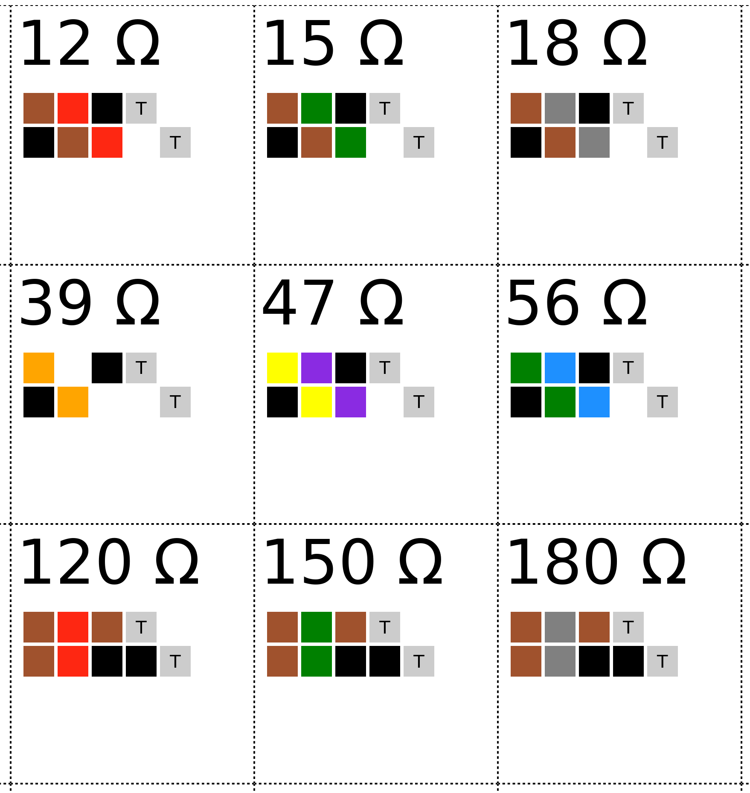

# resistor-organizer-labels

Generate paper labels for labelling THT resistors in a drawer or similar compartmented storage.

## Usage

Change the label size in the `<style>` part of the `resistors.html` file and print.

## Result (excerpt)

